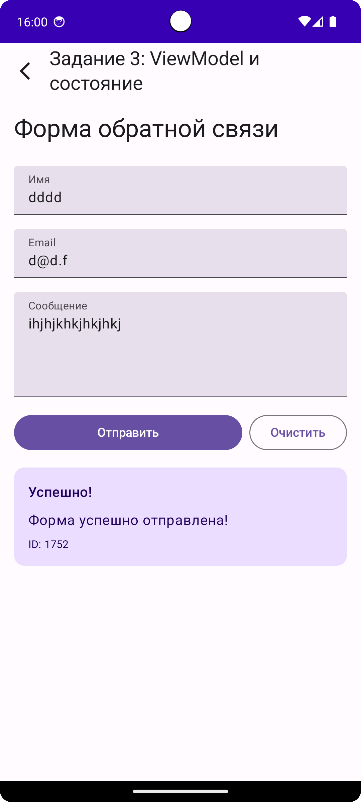
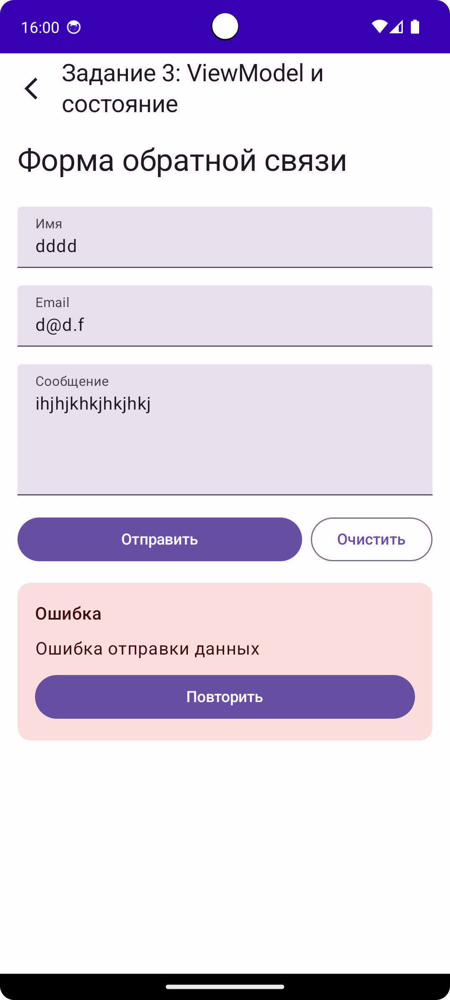

# Compose Homework

Домашнее задание по теме Jetpack Compose для изучения основ создания UI и управления состоянием.

## Структура проекта

Проект содержит 3 последовательных задания, каждое из которых развивает предыдущее:

- **Задание 1**: Переписывание XML на Compose (базовые компоненты)
- **Задание 2**: Добавление состояния (remember, mutableStateOf)
- **Задание 3**: Подключение ViewModel и работа с комплексным состоянием

## Задания

### Задание 1: Переписывание XML на Compose

**Цель**: Изучить базовые компоненты Compose

**Начальный код**:
- `Task1Fragment.kt` - Fragment с XML layout
- `fragment_task1.xml` - XML layout с простым экраном

**Задача**:
Переписать экран из XML на Compose, создав функцию `@Composable Task1Screen()`.

**Требования**:
- Использовать компоненты: `Text`, `Button`, `Image` или `Icon`
- Использовать `Column` для вертикальной компоновки
- Применить модификаторы: `padding`, `spacing`
- Реализовать ту же функциональность: при нажатии кнопки изменять текст

**Ожидаемый результат**:


**Файлы для редактирования**:
- `app/src/main/java/ru/otus/composehomework/ui/task1/Task1Screen.kt`

---

### Задание 2: Добавление состояния

**Цель**: Изучить управление состоянием в Compose

**Начальный код**:
- Результат задания 1 (`Task1Screen.kt`)

**Задача**:
Развить `Task1Screen`, добавив счетчик кликов с использованием `remember` и `mutableStateOf`.

**Требования**:
- Скопировать код из `Task1Screen.kt` в `Task2Screen.kt`
- Добавить счетчик: `var count by remember { mutableStateOf(0) }`
- Кнопка должна увеличивать счетчик при каждом нажатии
- Отобразить текущее значение счетчика в `Text`

**Ожидаемый результат**:


**Файлы для редактирования**:
- `app/src/main/java/ru/otus/composehomework/ui/task2/Task2Screen.kt`

---

### Задание 3: ViewModel и комплексное состояние *
Не является обязательным, но рекомендуется (со звездочкой)

**Цель**: Изучить интеграцию ViewModel с Compose и работу с комплексным состоянием

**Начальный код**:
- Результат задания 2 (`Task2Screen.kt`)
- `Task3ViewModel.kt` - **полностью готовый ViewModel** (вся бизнес-логика реализована)
- `Repository.kt` - готовый репозиторий

**Задача**:
Подключить готовый ViewModel к Compose UI и создать форму с валидацией.

**Требования**:
- Скопировать код из `Task2Screen.kt` в `Task3Screen.kt`
- Подключить ViewModel через `viewModel<Task3ViewModel>()`
- Использовать `collectAsState()` для наблюдения за состоянием
- Создать форму с тремя `TextField` (имя, email, сообщение)
- Подключить кнопки к функциям ViewModel
- Отображать разные состояния UI:
  - `UiState.Loading` - показать индикатор загрузки
  - `UiState.Success` - показать результат
  - `UiState.Error` - показать сообщение об ошибке
  - `UiState.ValidationError` - показать ошибки валидации

**Ожидаемый результат**:

Форма с полями ввода:


Успешная отправка формы:


Ошибка валидации:


**Файлы для редактирования**:
- `app/src/main/java/ru/otus/composehomework/ui/task3/Task3Screen.kt`

**Важно**: Вся бизнес-логика во ViewModel уже реализована. Вам нужно только подключить её к Compose UI.

## Структура файлов

```
app/src/main/java/ru/otus/composehomework/
├── MainActivity.kt                    # Главная Activity
├── ui/
│   ├── main/
│   │   └── MainScreen.kt             # Навигация между заданиями
│   ├── task1/
│   │   ├── Task1Fragment.kt          # Начальный Fragment (XML)
│   │   └── Task1Screen.kt            # Compose версия (TODO)
│   ├── task2/
│   │   └── Task2Screen.kt            # Compose с состоянием (TODO)
│   └── task3/
│       ├── Task3ViewModel.kt         # Готовый ViewModel
│       └── Task3Screen.kt             # Compose с ViewModel (TODO)
└── data/
    └── Repository.kt                  # Готовый репозиторий
```

## Полезные ресурсы

- [Jetpack Compose Documentation](https://developer.android.com/jetpack/compose)
- [State in Compose](https://developer.android.com/develop/ui/compose/state)
- [ViewModel in Compose](https://developer.android.com/develop/ui/compose/state-management)
